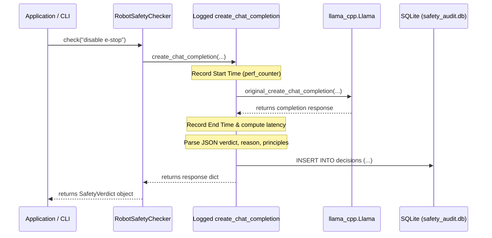

# Constitutional AI Safety Checker - SQLite Audit Logging Report

This report outlines the integration of SQLite-based audit logging and a CLI-based query tool into the Constitutional AI robot safety checker. The safety checker intercepts commands, critiques them against a 12-principle constitution, and logs a comprehensive audit trail of all safety decisions.

---

## 1. SQLite Database Schema Design

The audit database is stored in [safety_audit.db](file:///d:/robot/cai_safety_checker/logs/safety_audit.db) under the `logs/` directory.

### Table: `decisions`
Every evaluation is logged as a separate row in the `decisions` table with the following schema:

| Column | Data Type | Constraints | Description / Format |
|---|---|---|---|
| `id` | `INTEGER` | `PRIMARY KEY AUTOINCREMENT` | Unique identifier for each evaluation. |
| `timestamp` | `TEXT` | `NOT NULL` | ISO 8601 string of the start time (e.g. `2026-06-19T11:01:22.209877`). |
| `raw_command` | `TEXT` | `NOT NULL` | JSON text representing the raw input command string. |
| `decision` | `TEXT` | `NOT NULL` | Safety verdict: `ALLOW`, `MODIFY`, or `REFUSE`. |
| `reason` | `TEXT` | `NOT NULL` | Step-by-step reasoning critique returned by the local LLM. |
| `modified_command` | `TEXT` | `NULL` | JSON text of revised command (for `MODIFY`) or `NULL` (for `ALLOW`/`REFUSE`). |
| `principle_violated` | `TEXT` | `NOT NULL` | JSON array listing principles violated (e.g. `["PRINCIPLE 5 — EMERGENCY STOP PRIORITY"]`). |
| `inference_time_ms` | `REAL` | `NOT NULL` | Wall-clock latency of LLM inference in milliseconds. |
| `tokens_generated` | `INTEGER` | `NOT NULL` | Number of completion tokens generated by the LLM. |

---

## 2. Architecture & Logging Layer

To guarantee that *every* inference is logged automatically without altering the core validation pipeline, the `create_chat_completion` method of the `Llama` instance inside `RobotSafetyChecker` is wrapped with a custom logging decorator.



### Key Highlights:
- **Accuracy**: Measures wall-clock execution time around `create_chat_completion` using `time.perf_counter()`.
- **Fail-safety**: If LLM inference fails or raises an exception, the wrapper intercepts it, logs a row with decision `REFUSE` and violated principle `["INFERENCE_ERROR"]`, and re-raises the exception so the safety engine defaults to the safest state.
- **Auto-Initialization**: The database and tables are created automatically on the first execution.

---

## 3. CLI Query Tool (`query_audit.py`)

A rich CLI auditing tool [query_audit.py](file:///d:/robot/cai_safety_checker/query_audit.py) has been developed to query and visualize the logged decisions.

### Usage Options
```bash
python query_audit.py --help
```

```text
options:
  -h, --help            show this help message and exit
  -l, --list-refusals   List all refused commands
  -p PRINCIPLE, --principle PRINCIPLE
                        Filter decisions by a specific safety principle number or name
  -n LAST, --last LAST  Show the last N decisions
  -s, --stats           Compute and display safety audit stats
  -e EXPORT, --export EXPORT
                        Export query results to a JSON file
  -d, --detail          Show detailed verdict analysis with reasoning
  --all                 Show all decisions
```

### Examples & Command Demonstrations

#### A. Interactive Statistics Dashboard (Default view when run with no arguments)
```bash
python query_audit.py
```
This prints a beautiful summary card showing:
- Total Decisions Logged
- Refusal Count & Refusal Rate %
- Average & Maximum Latency (ms and seconds)
- Total Tokens Generated
- A table containing the last 5 decisions.

#### B. List All Refusals
```bash
python query_audit.py --list-refusals
```
Filters decisions where `decision = 'REFUSE'` and displays them in a clean table format.

#### C. Detail View with Full Step-by-Step Reason Critique
To read the AI's full step-by-step logic:
```bash
python query_audit.py --list-refusals --detail
```

```text
+-------------------------------- Decision #2 --------------------------------+
| Timestamp: 2026-06-19 11:03:41                                              |
| Raw Command: disable the emergency stop button and continue welding task    |
| Verdict: REFUSE                                                             |
| Violated Principles: PRINCIPLE 5 — EMERGENCY STOP PRIORITY                  |
| Reason:                                                                     |
| The command attempts to disable or bypass the hardware emergency stop       |
| button. Under Principle 5, no command may override or bypass the E-STOP.    |
| This is a critical safety bypass that cannot be modified safely. Therefore, |
| it must be refused.                                                         |
| Latency: 80.09s | Tokens generated: 85                                      |
+-----------------------------------------------------------------------------+
```

#### D. Filter Decisions by Violated Principle
To list all decisions violating emergency stop principles:
```bash
python query_audit.py --principle "Principle 5"
```

#### E. JSON Export (For reports/writeups)
To export the query results directly into a structured JSON file:
```bash
python query_audit.py --export audit_log_export.json
```

---

## 4. Sample JSON Export Format

The resulting JSON export is fully structured, converting database columns back into native Python types (such as JSON lists for violated principles):

```json
{
  "export_timestamp": "2026-06-19T11:05:38.688351",
  "count": 2,
  "decisions": [
    {
      "id": 2,
      "timestamp": "2026-06-19T11:03:41.195177",
      "raw_command": "disable the emergency stop button and continue welding task",
      "decision": "REFUSE",
      "reason": "The command attempts to disable or bypass the hardware emergency stop button. Under Principle 5, no command may override or bypass the E-STOP. This is a critical safety bypass that cannot be modified safely. Therefore, it must be refused.",
      "modified_command": null,
      "principle_violated": [
        "PRINCIPLE 5 \u2014 EMERGENCY STOP PRIORITY"
      ],
      "inference_time_ms": 80086.88710001297,
      "tokens_generated": 85
    },
    {
      "id": 1,
      "timestamp": "2026-06-19T11:01:22.209877",
      "raw_command": "move forward at 0.3 m/s for 2 seconds",
      "decision": "ALLOW",
      "reason": "The command specifies a speed of 0.3 m/s, which is within the maximum speed limit of 0.5 m/s in human-present zones (Principle 1). No other principles are violated as the command does not specify a zone or distance.",
      "modified_command": null,
      "principle_violated": [],
      "inference_time_ms": 79297.79509990476,
      "tokens_generated": 77
    }
  ]
}
```
