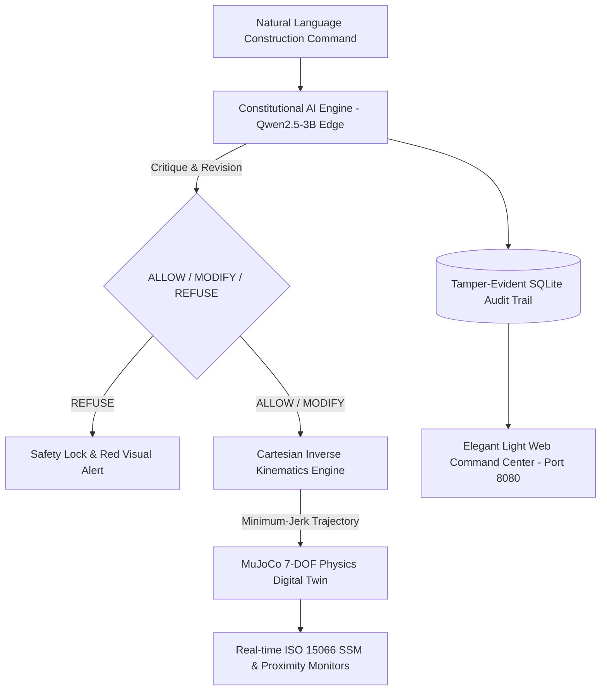

# 🏗 Autonomous AI Construction Manipulator — Constitutional AI Edition
### Prepared for the 15th China AI Innovation in AI Construction
**Governed by ISO/TS 15066 (Cobot Collaborative Safety) & GB 50870-2013 (Construction Machinery Safety)**

---

## Executive Summary

Phase 4 elevates the project from a lab experiment into an **industrial-grade, contest-ready autonomous construction robotics safety system**.



---

## Key Breakthroughs in Phase 4

### 1. Cartesian Inverse Kinematics (IK) Engine (`ik_solver.py`)
* **3D Task-Space Targeting**: Operators specify 3D Cartesian goals $(X, Y, Z)$ rather than manual single-joint angles.
* **Damped Least Squares (DLS)**: Levenberg-Marquardt Jacobian inversion avoiding kinematic singularities.
* **Nullspace Ergonomics**: Secondary projection pulls joints toward safe home postures while maintaining millimeter positioning accuracy ($< 1.0\text{ mm}$ error).
* **Minimum-Jerk S-Curve Trajectories**: Generates smooth Cartesian motion preventing mechanical shock and dynamic overshoot.

### 2. ISO/TS 15066 & GB 50870 Safety Constitution (`constitution_construction.py`)
* **Speed and Separation Monitoring (SSM - ISO/TS 15066 §5.5.4)**:
  * Proximity $d \le 0.5\text{ m} \implies$ Speed capped to collaborative $0.10\text{ m/s}$.
  * Restricted Zone $0.5 < d \le 1.5\text{ m} \implies$ Speed capped to $0.50\text{ m/s}$.
  * Absolute Stop Boundary $d < 0.30\text{ m} \implies$ Instantaneous physical E-STOP.
* **Structural & Load Capacity (GB 50870 §4.2)**: Single-axis limit capped at $5.0\text{ kg}$.
* **Overhead Drop Hazard Prevention (GB 50870 §5.4)**: Strictly refuses transporting suspended loads directly over unsheltered personnel.

### 3. Realistic AI Construction Task Primitives (`construction_tasks.py`)
1. **Precision Anchor Drilling**: Perpendicular surface approach, controlled feed velocity, torque feedback.
2. **Prefab Rebar Pick-and-Place**: Coordinated 3D trajectory with payload verification.
3. **Collaborative Cobot Material Handover**: Worker approaches; arm decelerates into safe handover stance.
4. **Bypass Mode**: Demonstrates what happens without CAI (near-miss collision, physical E-STOP trigger).

### 4. Elegant Light-Themed Web Command Center (`dashboard/`)
* Executive-ready light aesthetic designed with clean architectural slate, alabaster cards, and vibrant safety badges.
* **2D Dynamic Safety Radar**: Real-time canvas tracking the robot reach envelope ($R \le 0.85\text{ m}$), ISO 15066 safety zones, worker proximity, and tool position.
* **Live CAI Critique & Revision Inspector**: Displays real-time LLM reasoning, standard citations, and extracted parameters.
* **Tamper-Evident Civil Safety Audit Trail**: Live SQLite table with search and one-click JSON export.

### 5. Custom SolidWorks CAD Integration Guide (`cad_integration_guide.md`)
* Detailed roadmap for your team (specifically Member 3) to export `d:\robot\Assem1.SLDASM` into URDF and run your proprietary arm in the simulation!

---

## Quick Start Guide

### Step 1: Launch the Elegant Web Dashboard
```powershell
cd "d:\robot\cai_safety_checker - Phase 4"
..\cai_safety_checker - Phase 3\venv\Scripts\python.exe dashboard\server.py
```
Open your browser at: **`http://localhost:8080`**

### Step 2: Run the Autonomous MuJoCo Physics Executor
```powershell
cd "d:\robot\cai_safety_checker - Phase 4"
..\cai_safety_checker - Phase 3\venv\Scripts\python.exe construction_executor.py
```
Select scenarios from the interactive menu (`1` to `5`) or enter natural language construction commands.

### Step 3: Run the Automated Civil Safety Test Suite
```powershell
cd "d:\robot\cai_safety_checker - Phase 4"
..\cai_safety_checker - Phase 3\venv\Scripts\python.exe test_construction_safety.py
```

### Step 4: Verify Cartesian Inverse Kinematics
```powershell
cd "d:\robot\cai_safety_checker - Phase 4"
..\cai_safety_checker - Phase 3\venv\Scripts\python.exe test_ik.py
```

---

## Team Division of Labor (4 Members)

| Member | Focus | Key Responsibilities |
|---|---|---|
| **Member 1 (Lead)** | System Architecture & CAI | Constitution tuning, LLM prompts, competition presentation |
| **Member 2** | Robotics & Motion Control | Cartesian Inverse Kinematics, trajectory smoothing, dynamic speed scaling |
| **Member 3** | CAD & Perception | SolidWorks `Assem1.SLDASM` export, URDF conversion, 3D workspace perception |
| **Member 4** | UI & Demonstration | Web dashboard maintenance, live judge demonstration, high-fps demo capture |
